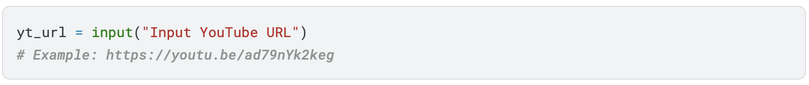
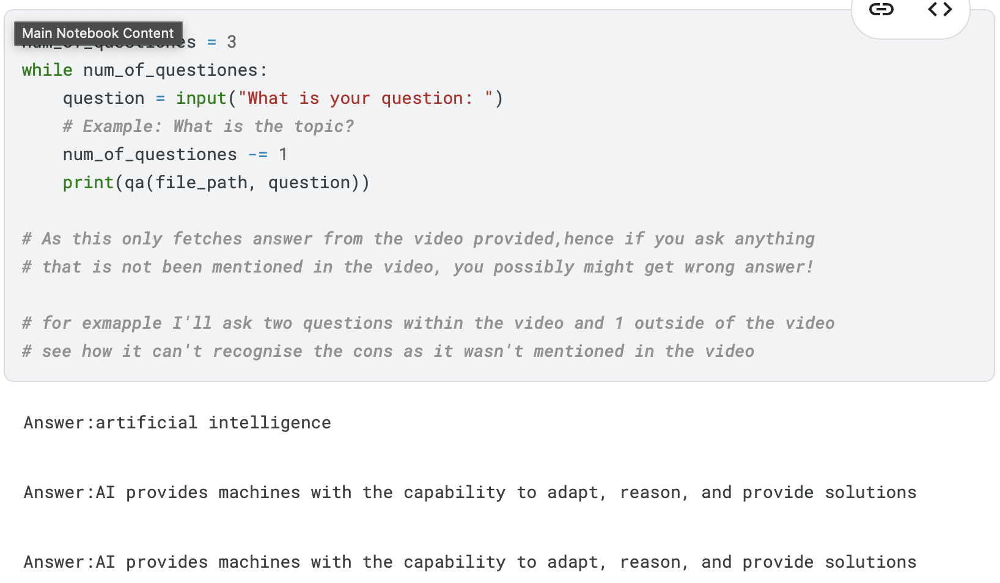
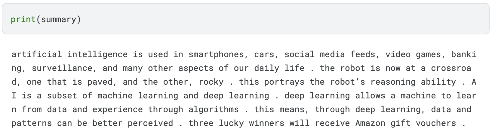

# TubeQuery

**TubeQuery** is an LLM-based model designed to fetch queries related to YouTube videos. By simply inputting a video link, you can ask questions about the video's content and receive answers.

Here is the [publication](https://app.readytensor.ai/publications/sw0uANUAdEXE) of TubeQuery. 

## Overview

TubeQuery leverages advanced Natural Language Processing (NLP) techniques to analyze video content. It extracts audio, transcribes it, and then uses a language model to answer questions related to the video's content. This makes it easy to get quick answers and summaries from video lectures, tutorials, interviews, and more.

## Features

Here's a breakdown of the key features of TubeQuery:

1. **Video Analysis and Processing:**
   - Accepts video links (e.g., YouTube) as input.
   - Automatically extracts audio from the provided video link.
   - Performs speech-to-text conversion using OpenAI's Whisper model to generate accurate transcripts.
   - Enables querying of the video content based on the generated transcript.

   

2. **Natural Language Query Support:**
   - Allows users to ask questions in natural language, making it intuitive and user-friendly.
   - Provides accurate and contextually relevant answers derived directly from the video content.

   

3. **Transcript Summarization:**
   - Offers the capability to summarize lengthy videos into concise summaries.
   - Highlights the most important key points, saving users valuable time.

   

4. **Multi-Language Support:**
   - Supports transcription and querying in multiple languages, depending on the language spoken in the video.

5. **Adaptable Framework:**
   - Designed to work with videos from various platforms, as long as they are accessible via a public link.
   - Compatible with a wide range of video content, including educational tutorials, academic lectures, and engaging interviews.

---

## Future Improvements

The following are planned enhancements for future versions of TubeQuery:

1. **Enhanced Accuracy:**
   - Integrating more advanced AI models to further improve the accuracy of both transcription and query responses.
   - Implementing context-aware models to better understand complex or potentially ambiguous queries.

2. **Real-Time Processing:**
   - Exploring the possibility of enabling live video analysis to provide real-time query responses during live events or streams.

3. **Support for Multiple Video Sources:**
   - Expanding support to include private videos, YouTube playlists, and the option for users to upload custom media files.

4. **Improved Interface:**
   - Developing a more interactive and user-friendly interface, potentially including features like voice input for queries and enhanced visualization of results.

5. **Advanced Analytics:**
   - Incorporating advanced analytics features to provide insights into video content, such as sentiment analysis, keyword extraction, and topic detection.

6. **Integration with External Tools:**
   - Aiming to integrate with popular note-taking applications, learning management systems (LMS), and collaboration platforms to enhance usability and workflow.

7. **Cloud-Based Deployment:**
   - Transitioning to a cloud-based deployment to allow for scalable processing of larger datasets and to handle high traffic usage efficiently.

8. **Personalization:**
   - Implementing personalization features to enable user-specific recommendations and adjustments based on individual preferences and past query history.

---

## Tech Stack

TubeQuery is built using the following technologies:

1. **Backend:**
   - **Programming Language**: Python
   - **Framework**:  Utilizes standard libraries and direct implementation without relying on extensive API frameworks.

2. **Speech-to-Text:**
   - **Libraries**: OpenAI Whisper for accurate and efficient speech-to-text conversion.

3. **Natural Language Processing:**
   - **Libraries/Models**: Hugging Face Transformers for advanced NLP tasks and question answering.

4. **Video Processing:**
   - **Tools**: FFMPEG is used for robust audio extraction and general video handling.
